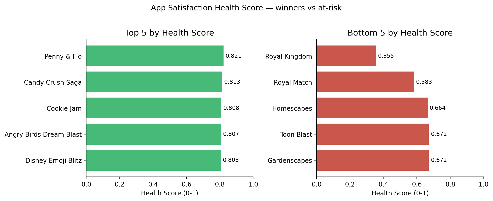
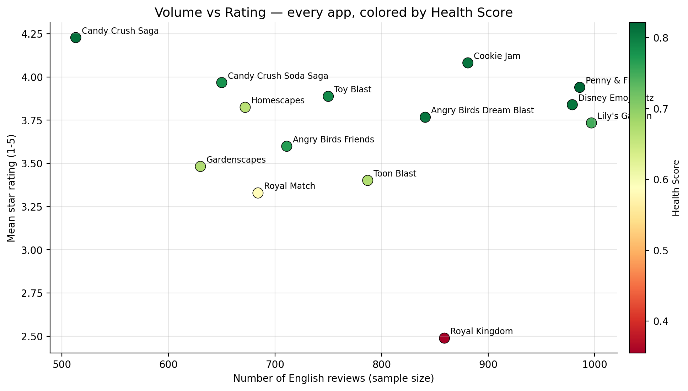
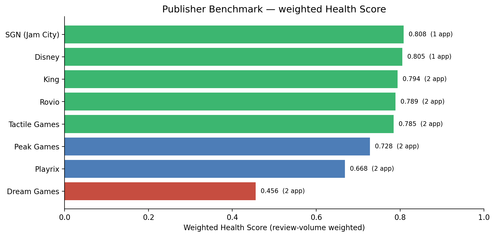
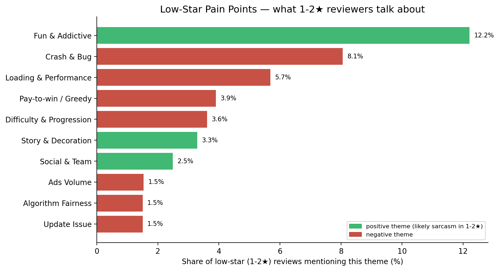
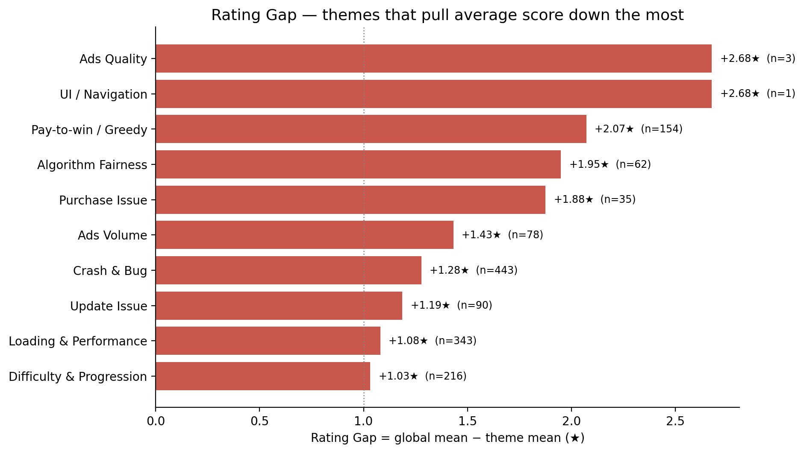
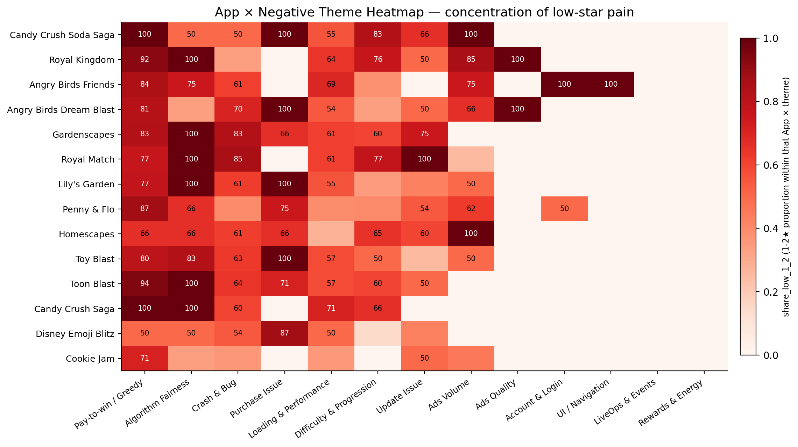
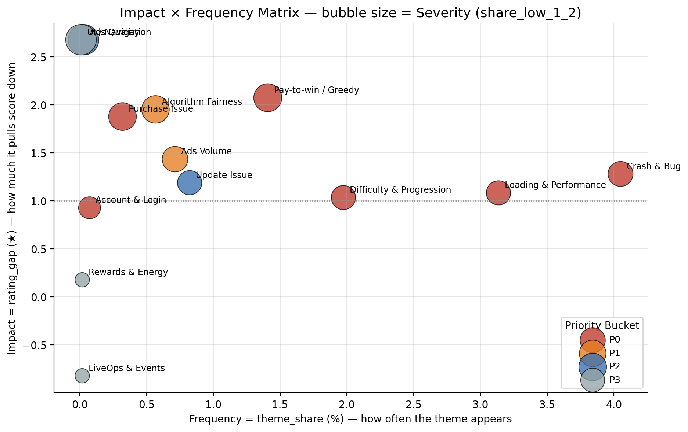
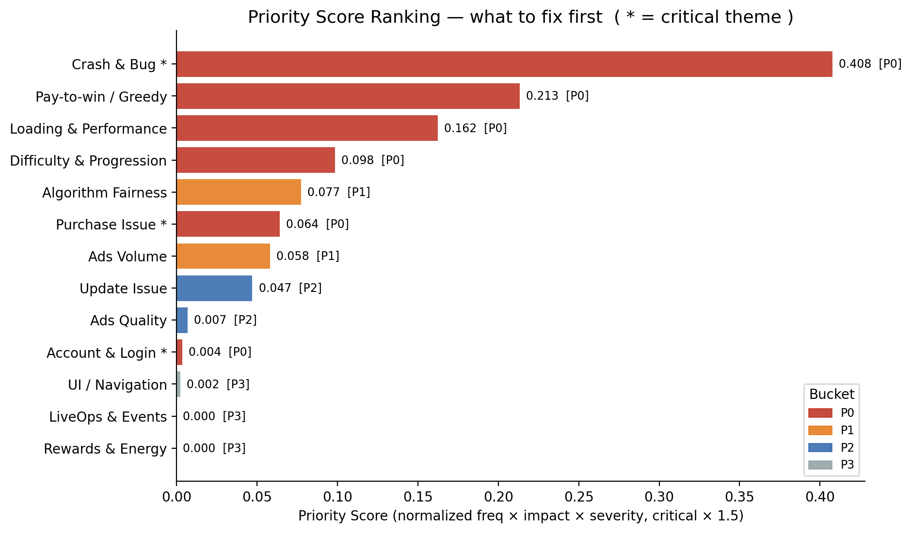

# User Satisfaction Insight Report (v1)

# 用户满意度洞察报告（v1）

> Mobile Casual Games — Google Play public reviews
> 移动休闲游戏 · Google Play 公开评论 · BQ1–BQ5 一份完整报告
>
> Source: 10,940 English reviews across 14 apps & 7 publishers (collected 2024-02 → 2026-05).
> Generated from Day 1–5 pipeline outputs. See methodology in
> `docs/business_design/business_scope_three_layer_design.md`.

---

## Executive Summary / 摘要

**EN — Six numbers a stakeholder can repeat tomorrow:**

1. **14 apps, 7 publishers, 10,940 English reviews** form the cross-section. Average adjusted rating is **~3.68 ★** (Bayesian, k = 200).
2. **#1 Health Score: Penny & Flo (0.821)**; **#14 Royal Kingdom (0.355)** — a 2.3× spread within a single comparable category, showing the metric discriminates real satisfaction differences.
3. **Royal Kingdom is the single largest portfolio risk**: 60.7% of its reviews are 1–2★ and Dream Games’ weighted publisher score (0.456) is the lowest of all 7 publishers.
4. **Crash & Bug is the #1 fix-backlog driver across the entire pool**: it pulls average rating down by **+1.28★** wherever it appears, and 56.9% of those reviews are 1–2★.
5. **6 of 13 negative themes land in P0** of the BQ5 priority backlog. Critical-blocker themes (`crash_bug`, `account_login`, `purchase_issue`) are automatically promoted regardless of frequency.
6. **Positive driver is real, not just noise**: "Fun & Addictive" appears in 32.6% of all reviews, average 4.40★ — this is the moat to protect when shipping any change that touches difficulty or monetization.

**CN — 六条带数字的汇报口径：**

1. **14 个 App、7 家 Publisher、10940 条英文评论**构成横截面；整体贝叶斯调整平均分约 **3.68 ★**。
2. **健康分第一：Penny & Flo（0.821）；倒数第一：Royal Kingdom（0.355）** —— 同品类内差距 2.3×，证明这个指标真的能区分体验差异。
3. **Royal Kingdom 是组合里最大的风险源**：60.7% 评论是 1-2★，所在的 Dream Games 加权 publisher 得分 0.456 也是 7 家最低。
4. **Crash & Bug 是全池子第一号修复目标**：一旦评论里提到，平均拉低 **+1.28 ★**，且 56.9% 是 1-2★。
5. **13 个负向主题中有 6 个进入 P0**；阻断型主题（崩溃 / 登录 / 付款）即使频率不高也会自动升级 P0。
6. **正向驱动真实存在**：Fun & Addictive 在 32.6% 评论里出现、平均 4.40★ —— 这是任何改难度或商业化前必须保护的护城河。

---

## §1 Scope & Honesty / 数据范围与诚实声明

**EN —** All metrics in this report are **review-based proxy signals** of perceived satisfaction. The pipeline scrapes only **English** reviews from Google Play public pages: 10,940 rows after layered P0/P1/P2 cleaning. This is **not** a random sample, **not** the full user base, and **not** a substitute for retention / conversion / revenue / DAU.

**CN —** 本报告所有指标都是基于评论的**感知满意度 proxy 信号**。数据来源是 Google Play 公开页面、仅英文评论，分层 P0/P1/P2 清洗后保留 10940 条。这**不是**随机样本、**不代表**全部用户、**不能替代**留存 / 转化 / 收入 / DAU。所有结论需带这一句话作前提。

| Item | Value |
|---|---|
| Apps in pool | 14 |
| Publishers | 7 |
| English reviews after cleaning | 10,940 |
| Date range | 2024-02-12 → 2026-05-04 |
| Global Bayesian mean (k = 200) | 3.676 |

---

## §2 BQ1 — Overall Satisfaction Health / 整体满意度健康

**EN —** Health Score combines **Level** (40%, Bayesian-adjusted rating), **Polarization** (35%, low-star risk), **Momentum** (25%, recent rating trend), then multiplies by **Confidence** (review-volume based, capped at 1.0). Apps in the pool all carry confidence ≈ 1.0 (n ≥ 513).

- **Top 3**: Penny & Flo (0.821), Candy Crush Saga (0.813), Cookie Jam (0.808).
- **Bottom 3**: Homescapes (0.664), Royal Match (0.583), Royal Kingdom (0.355).
- **Spread**: 0.355 → 0.821 within a single comparable category — the metric is **not flat**.

**CN —** 健康分 = Level（40%，贝叶斯调整后的均分）+ Polarization（35%，1 − 低星占比）+ Momentum（25%，最近趋势），最后乘 Confidence（按样本量上限 1.0）。本池子所有 App 的 Confidence 都是 1.0（每个 App 评论 ≥ 513 条）。

- **前三**：Penny & Flo（0.821）、Candy Crush Saga（0.813）、Cookie Jam（0.808）。
- **后三**：Homescapes（0.664）、Royal Match（0.583）、Royal Kingdom（0.355）。
- **差距**：0.355 → 0.821，同品类差距 2.3×，说明指标是「真区分」而非平均化。

---

## §3 BQ2 — Competitor / Publisher Benchmark / 竞品与公司层面对比

**EN —** Aggregating to publisher level (review-volume weighted) flips the storyline from "which app" to "which company's product culture is healthier":

- **Best publisher**: SGN/Jam City (0.808, 1 app — Cookie Jam).
- **Worst publisher**: Dream Games (0.456, 2 apps — Royal Match + Royal Kingdom).
- King and Rovio sit in the 0.79 band — multi-product portfolios with consistent execution.
- **Volume-vs-Rating scatter** identifies the diagonal where high review volume meets low rating — Royal Kingdom is the most isolated outlier.

**CN —** 用评论量加权聚合到 publisher 层面后，故事从"哪款 App"变成"哪家公司的产品体验更稳"：

- **最佳**：SGN/Jam City（0.808，1 款 — Cookie Jam）。
- **最弱**：Dream Games（0.456，2 款 — Royal Match + Royal Kingdom 都拖后腿）。
- **King / Rovio** 处于 0.79 一档 —— 多产品组合下执行依然稳定。
- **声量 vs 评分散点图**里，Royal Kingdom 是「高声量 + 低评分」最孤立的离群点。

---

## §4 BQ3 — Pain Points / 低分痛点

**EN —** 18 themes (13 negative, 5 positive) were tagged via rule-based multi-label keyword matching; v2 dictionary cleared the obvious negation false positives (e.g. "used to be fun" no longer counts as positive). Theme coverage: **45.2%** of reviews carry ≥1 theme.

Top **rating-damaging** negative themes (negative themes only):

| Theme | n_reviews | rating_gap (★) | share_low_1_2 |
|---|---:|---:|---:|
| **Crash & Bug** | 443 | **+1.28** | 56.9% |
| **Loading & Performance** | 343 | +1.08 | 51.9% |
| Difficulty & Progression | 216 | +1.03 | 52.3% |
| Pay-to-win / Greedy | 154 | +2.07 | 79.2% |
| Update Issue | 90 | +1.19 | 52.2% |
| Ads Volume | 78 | +1.43 | 61.5% |

**CN —** 18 个主题（13 个负向、5 个正向）通过关键词规则多标签匹配；v2 字典已修掉典型的否定假阳性（如 "used to be fun" 不再算正向）。主题覆盖率：**45.2% 评论命中至少 1 个主题**。

最"伤评分"的负向主题（按 rating_gap 排）：上表。Crash & Bug 在全样本一旦被提，就拉低 1.28★，是头号工程修复对象；Pay-to-win 单次伤害最大（2.07★），且 79.2% 是 1-2★，需产品+经济侧统筹。

---

## §5 BQ4 — Positive Drivers / 高分驱动

**EN —** Don’t treat the dashboard only as a complaint engine. The positive themes are the moat:

| Theme | n_reviews | theme_share | mean_score |
|---|---:|---:|---:|
| Fun & Addictive | 3,567 | 32.6% | **4.40 ★** |
| Story & Decoration | 519 | 4.7% | 3.98 ★ |
| Visual & Graphics | 239 | 2.2% | **4.57 ★** |
| Social & Team | 230 | 2.1% | 3.43 ★ |
| Updates & New Content | 39 | 0.4% | 3.46 ★ |

**Royal Kingdom — what to protect even while fixing P0s**: Fun & Addictive is still 18.7% of its in-app reviews; if monetization changes wipe that out, the recovery becomes harder.

**Candy Crush Saga — case study of a stable positive moat**: 30% of its reviews mention Fun & Addictive at 4.62★, with low-star share only 5.2%. The franchise endures because the core fun signal is so clean.

**CN —** 仪表盘不只是「投诉机器」。正向主题就是护城河：上表。

- **Royal Kingdom** —— 即便狠修 P0，也要保护：Fun & Addictive 仍在它内部评论里占 18.7%。
- **Candy Crush Saga** —— 稳定正向护城河的范本：30% 评论提到 Fun & Addictive、平均 4.62★，低星仅 5.2%。

---

## §6 BQ5 — Priority Backlog / 优先级与产品建议

**EN —** Priority Score = normalized(Frequency) × normalized(Impact) × normalized(Severity) × 1.5^is_critical, where critical = {crash_bug, account_login, purchase_issue}. Quantile-based P0/P1/P2/P3 buckets are computed on **negative themes only**; positive themes are kept in the table but excluded from the fix backlog.

**Negative theme distribution**: P0 × 6, P1 × 2, P2 × 2, P3 × 3.

| Bucket | Theme | Owner | Recommended Action | 30-day goal |
|---|---|---|---|---|
| **P0** | Crash & Bug (critical) | Engineering | Crash triage + top-stack fixes | Reduce 1-2★ share by 10-15% |
| **P0** | Pay-to-win / Greedy | Product + Economy | Rebalance moves/booster/paywall pacing | Same |
| **P0** | Loading & Performance | Engineering | Cold-start & lag-spike optimization | Same |
| **P0** | Difficulty & Progression | Game Design | Tune curve, reduce hard-level clustering | Same |
| **P0** | Purchase Issue (critical) | Product + Economy | Fix payment failure / refund edge cases | Same |
| **P0** | Account & Login (critical) | Platform/Backend | Stabilize login / sync / progress | Same |
| **P1** | Algorithm Fairness | Game Design | Audit RNG perception, expose feedback | Scoped optimization, track rating gap |
| **P1** | Ads Volume | Product + Economy | Cut ad frequency in early progression / fail loops | Scoped optimization, track rating gap |

**CN —** 优先级公式上面已经说明。负向主题分布：**P0×6, P1×2, P2×2, P3×3**。表中给出每个 P0/P1 项的 owner、建议动作、30 天目标，可直接进 backlog。

---

## §7 Limitations & Data Honesty / 局限与诚实声明

**EN —**

1. **Sampling**: Google Play public reviews ≠ random sample of users. Sort order, recency, and language filters all bias the pool.
2. **English-only**: ~65% of cleaned-stage reviews. Non-English subgroup excluded — markets like JP/KR may differ.
3. **Proxy not KPI**: Health Score and Priority Score reflect *perceived* satisfaction. They are not retention, ARPU, conversion, or DAU.
4. **Rule-based tagging**: 18-theme keyword dictionary has known limitations on sarcasm, mixed sentiment, and unique phrasings. Coverage of 45.2% means **a meaningful portion of reviews remains unclassified** — those should not be assumed to be empty of signal.
5. **Theme overlap**: Multi-label tagging means one review can drive multiple theme metrics — counts are not mutually exclusive.
6. **Cross-section, not causal**: This report describes the current state. It does NOT claim any of the recommendations will cause specific rating uplift; the 30-day goals are working targets, not predictions.
7. **No version / event-window analysis** in v1. Appendix G in the design doc reserves this for Phase 2.

**CN —**

1. **抽样**：Google Play 公开评论 ≠ 随机样本，受排序、时效、语种过滤影响。
2. **仅英文**：清洗后约 65% 评论。日韩等市场未覆盖。
3. **是 Proxy 不是 KPI**：Health / Priority 反映「感知满意度」，不是留存 / ARPU / 转化 / DAU。
4. **规则字典局限**：18 个主题对反讽、混合情绪、独特表达识别能力有限；45.2% 覆盖率意味着仍有大量评论未被分类，不能视为"无信号"。
5. **多标签可重复计**：一条评论会贡献到多个主题指标，计数不互斥。
6. **横截面 + 描述性**：本报告描述现状，**不承诺**任何建议必然带来评分提升。30 天目标是工作目标，不是预测。
7. **未做版本 / 事件窗口分析**：留作 Phase 2（设计文档 Appendix G）。

---

## §8 Next Steps (Phase 2) / 下一步

**EN —**

- **LLM-assisted theme tagging** for the unclassified 54.8% (and for sarcasm/mixed-sentiment edge cases).
- **iOS App Store expansion** for cross-platform satisfaction comparison.
- **Internal metric integration** (retention, IAP, ad engagement) to validate review-based proxies.
- **Event / version window analysis** once `reviewCreatedVersion` coverage ≥ 50%.
- **Causal evaluation** (A/B, regression discontinuity) once a fix actually ships and we can read pre/post evidence.

**CN —** 见 EN 同条；按设计文档 Future Work 路线推进。

---

## §9 Methodology Pointers / 方法论速查

| Topic | File |
|---|---|
| Cleaning layers (P0/P1/P2) | `scripts/02_clean/clean_and_eda.py` |
| Health Score formula | `scripts/06_insights/build_health_score.py` + `config/metrics.json` + design doc Appendix A/B/C/D |
| Theme taxonomy | `config/themes.yml` (v2) + design doc §11 |
| Theme tagging engine | `scripts/06_insights/build_review_themes.py` |
| Theme summaries | `scripts/06_insights/build_theme_summary_tables.py` |
| Priority Score | `scripts/06_insights/build_priority_recommendation_tables.py` + design doc §10.5 |
| Daily logs | `docs/daily_logs/day{1..6}_*.md` |
| Plain-language briefings | `reports/每日复盘/Day{4,5}_*.pdf` |
| This report (regenerate) | `python3 scripts/04_export/build_insight_report_pdf.py` |
